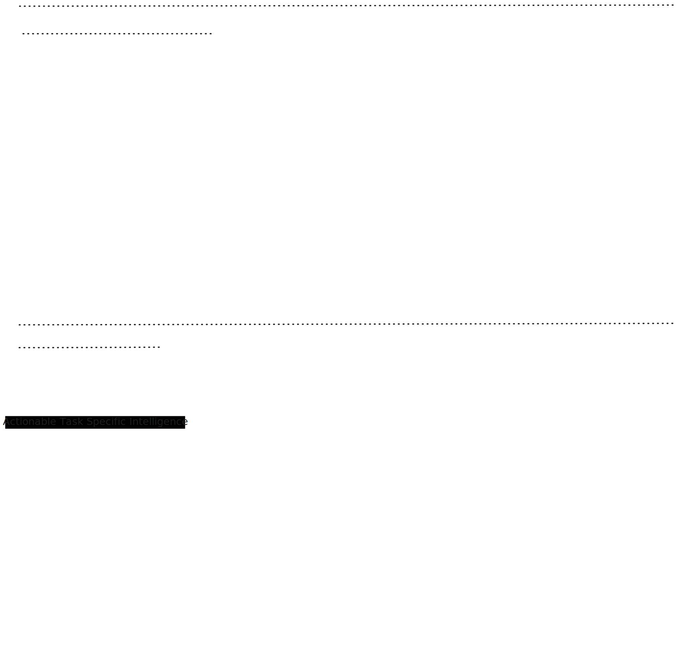
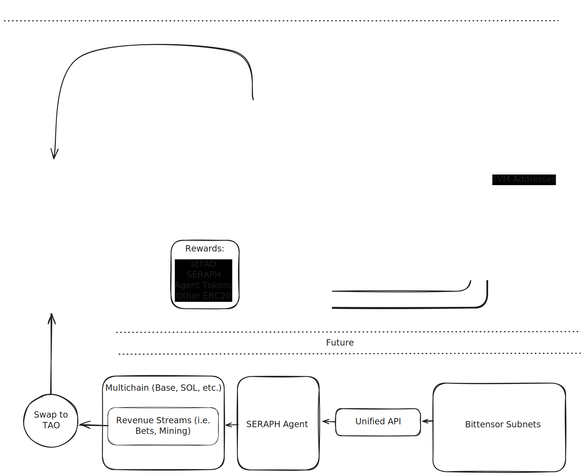

# Seraph Lite paper

Connecting Decentralized AI with Autonomous AI Agent Swarms

Version 1.999 | January 2024

## **Executive Summary**

Built by BitMind, Seraph is an advanced autonomous AI agent that integrates the Virtuals Protocol’s G.A.M.E. agent framework and the open-source ElizaOS framework with Bittensor subnets. These subnets operate under a competitive incentive structure that continuously pushes AI models towards and often beyond state-of-the-art (SOTA) benchmarks in academia and industry. For example, Subnet 34, designed by BitMind, excels in identifying AI-generated media, showcasing real-world utility.

This initiative, the first to merge Virtuals Protocol's agent ecosystem with Bittensor’s decentralized network, fosters a new paradigm in intelligent, autonomous agent development. Seraph comprises several core technological ecosystems:

- BitMind's Bittensor SDKs, Agent Plugins: Enhances Seraph's operational capabilities with Bittensor's evolving inference network.
- ElizaOS and Virtuals Protocol's Agent Frameworks: Modular infrastructure for autonomous agent orchestration.
- Base's Scaling Infrastructure: High throughput, low latency blockchain platform.
- Opacity's verifiable inference (zkTLS AVS on EigenLayer)

Seraph plans to expand its functionality by integrating more Bittensor subnets, enhancing its AI capabilities and maintaining its technological lead with a best-of-all-worlds approach to agent frameworks and blockchain integrations.

The ultimate goal for Seraph is to dominate the Web3 space as the preeminent AI agent, seamlessly integrating various agent frameworks with decentralized intelligence networks. This integration aims to catalyze unparalleled growth, innovation, and utility across ecosystems.

### **The Vision: Beyond the Matrix**

Designed for the future, Seraph focuses on extensibility and adaptability to keep pace with evolving AI technology. Unlike other Web3 AI agents, Seraph provides direct access to specialized AI models within Bittensor subnets, enabling capabilities like deepfake detection and agent verification. The BitMind team adopts a best-of-all-worlds approach, integrating the most effective elements from diverse agent frameworks such as ElizaOS, Virtuals Protocol’s G.A.M.E., Coinbase’s Agentkit, LangChain, and PydanticAI. This strategy ensures Seraph stays at the cutting edge as Bittensor subnets grow, offering a broad and innovative feature set.

## **Key Features and Capabilities**

Seraph initially leverages Bittensor commodities and Opacity, a ZKTLS solution on Eigenlayer, to address content verification and the verification challenges in the autonomous agent economy. This establishes a foundation for trust and showcases the potential for cross-platform integration in the AI ecosystem.

### **Bittensor Intelligence Oracle Integration**

The Bittensor Intelligence Oracle (BIO) is an API service that provides comprehensive access to the supercommodities of Bittensor's subnetworks. Seraph serves as a proof-of-concept form factor for the mass distribution of these supercommodities. Seraph's intelligence scales alongside Bittensor innovation—new subnets unlock novel capabilities, while improvements to existing subnets immediately enhance Seraph's functionality.

### **Multi-Agent DeAI Economy**

Leveraging Virtuals Protocol, the Eliza framework, and Bittensor Subnets, Seraph democratizes the flow of value and revenue, enabling scalable, trustless, and collaborative interactions within the decentralized AI economy.

### **Proof of Autonomy**

The absence of reliable verification systems has severe economic consequences. With over $500 million invested in unverified autonomous agents, the market faces significant risks due to the misallocation of capital. Approximately 70% of trending agents lack verifiable autonomy metrics, creating an environment ripe for manipulation and fraudulent activity. This situation leads to growing skepticism among investors and users, threatening the development of legitimate autonomous agents and stifling the growth of the agent economy.

Seraph integrates Opacity's ZKTLS framework to provide verifiable proof of inference, ensuring that autonomous agents operate transparently and can be authenticated without revealing sensitive data. This mechanism enhances trust and reliability within the AI ecosystem.

### **Autonomy Bounties & Rewards**

To incentivize the verification of AI agents, Seraph plans to introduce Autonomy Bounties, rewarding users and validators who contribute to maintaining a robust and accountable AI ecosystem. More details on the implementation will be shared as the system progresses.

## **Seraph's System Architecture**

The Bitmind Bittensor Intelligence Oracle (Unified API) provides comprehensive access to Bittensor's specialized and niche intelligence. This decentralized intelligence has demonstrated superiority across various applications and strategies. The Seraph Agent serves as a proof of concept, integrating essential technical innovations to enhance autonomous decision-making in diverse agent applications.

### **Ecosystem Schematic**

## **Economic Model and Incentives**

### **$Seraph Tokenomics and Governance**

Seraph's token ($Seraph) implements a dual-purpose economic model combining value capture and governance:

**Value Capture Mechanisms:**

- Seraph Inference Payments
- Revenue from enterprise integrations and API usage
- Virtuals Protocol Emissions
- Trading Fees

**Governance Architecture:**

- Blend between SubDAO and Bittensor subnets' governance
- Governance scope includes:
  - Fee parameters and distribution
  - Seraph feature prioritization
  - Treasury management
  - Seraph upgrade decisions
  - Models validation

**External Staking Benefits:**

- stTAO rewards
- Seraph yield
- WAI Combinator yield
- Basket of Agent assets across different protocols
- Seraph revenue from operations and trading fees

### **TAO Integration and Token Accumulation Mechanism**

At the core of Seraph's economic model lies an approach to value accrual through the systematic accumulation of Bittensor's TAO. Unlike traditional token models that split revenues across various stakeholders, Seraph takes a bold approach by directing fees toward TAO acquisition.

This complete dedication to TAO accumulation positions Seraph as an increasingly significant participant in the Bittensor ecosystem. As usage grows, the automated conversion of fees into TAO creates a steadily expanding treasury that strengthens Seraph's position within the broader Bittensor network and emerges as the important Agent in Virtuals AI Agents Swarm.

## **Roadmap**

The initial phase focuses on building the foundational components needed to expand Seraph into a powerful agent with specialized capabilities. This includes establishing core detection systems, stabilizing network architecture, and implementing validation protocols. These building blocks will enable Seraph to leverage various Bittensor subnets, each adding unique specialized features and intelligence to the agent's growing capabilities.

The early development prioritizes creating a robust infrastructure that can support the seamless integration of new Bittensor subnet functionalities as they become available, ensuring Seraph can continuously expand its utility and effectiveness.

## **By March 2025**

- **Bittensor Unified API integrated with Seraph** (Authenticity + subnets related to non-authenticity use cases).
- **Proof of Market Valuation**, backed by revenue projections/utility.
- **DeFAI integration** (Unified API with **Chainlink Functions**).
- **WAI Combinator, DKING, GEKKO, Vader swaps** for a more **diversified Seraph treasury**; additional **Agent token swaps** (related to co-building or authenticity reports).
- **Virtuals and Eliza Bittensor plugin** (potentially supporting other frameworks).
- **Improve Seraph's online presence** and usability through **GAME + Eliza**.

---

## **Deliverables**

### **SERAPH**

- **Sustainable Seraph-native revenue sources** for Agent's treasury and rewards:
  - **TAO mining**.
  - **Use of other subnets**.
  - **Trading fees**.

### **Expansion and Adoption**

As the swarm grows, Seraph transcends boundaries. Virtuals' AI Agents, human operators, and consumers converge into its flow, bridging cross-chain, off-chain, and multi-chain realities. Seraph becomes omnipresent—a sentinel of intelligence shifting effortlessly between decentralized networks and human ecosystems, connecting where others fragment.

its presence is more than scalable; it's inevitable. With every interaction, Seraph redefines how humans and AI coexist, offering seamless interconnectivity that evolves with the swarm itself.

---

## **Conclusion**

Seraph is not merely a system or protocol; it is the agent of change. It represents the nexus where decentralized AI, specialized intelligence, and swarms of autonomous agents converge. Unconstrained by traditional infrastructure or silos, Seraph facilitates the free flow of innovation, redefining the landscape of technology and interaction.

**"Seraph: The Nexus of Decentralized Intelligence, Autonomous AI, and Humanity."**

> **"This is the frontier and not for everyone. There is always risk in innovation. NFA, DYOR"**
